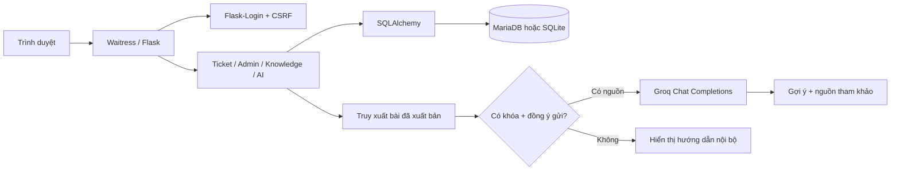
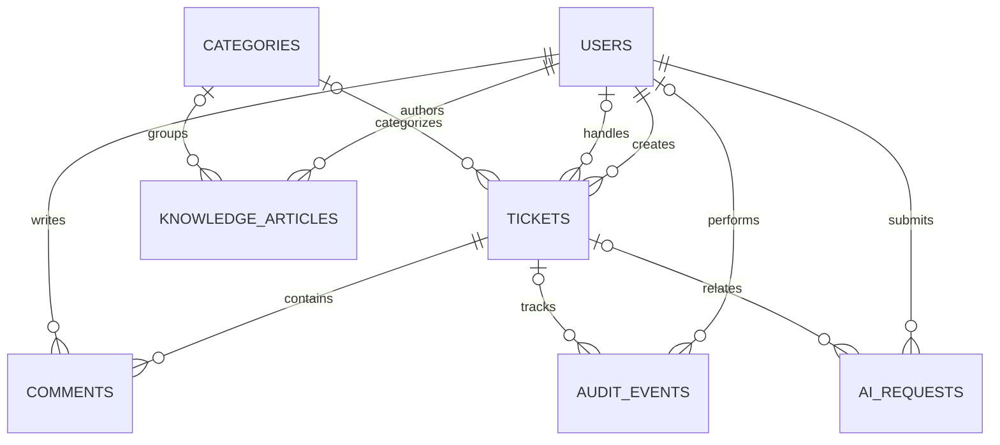
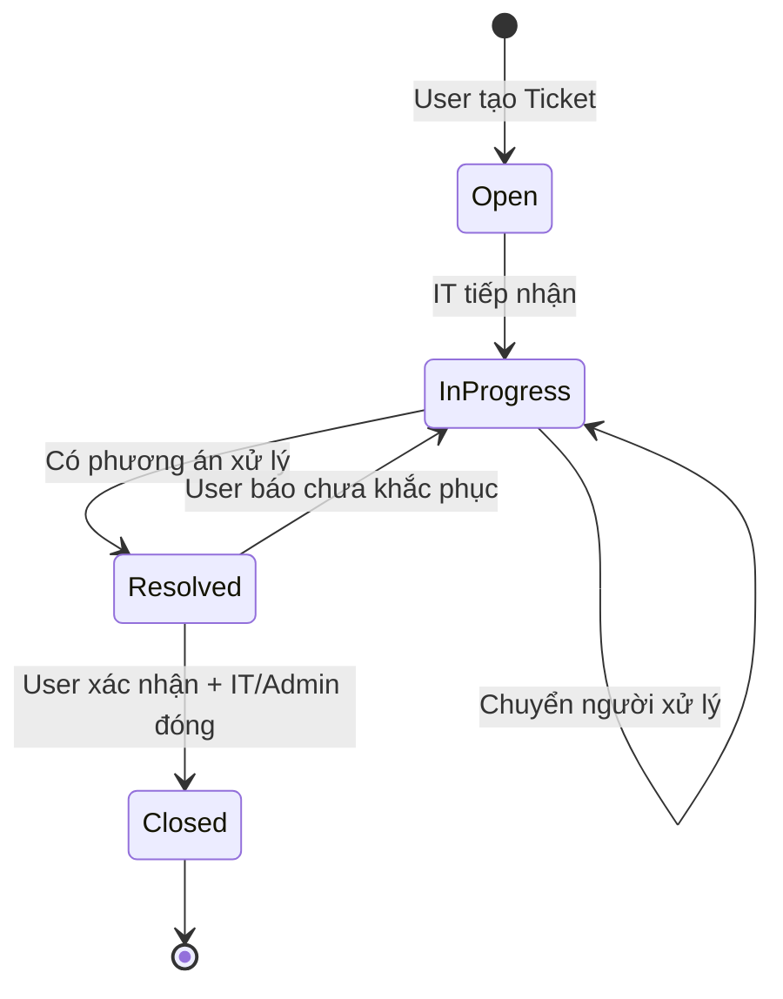

# Tài liệu nền cho báo cáo SmartTicket System

## 1. Bài toán và mục tiêu

Hệ thống quản lý yêu cầu hỗ trợ IT nhằm tập trung thông tin sự cố, phân công người xử lý, theo dõi tiến độ và nhận xác nhận từ người dùng. Kho kiến thức giúp tái sử dụng cách xử lý; trợ lý hỗ trợ tìm bài liên quan và tích hợp mô hình ngôn ngữ Groq để tổng hợp gợi ý khi được cấu hình.

Mục tiêu nghiệm thu là chạy được toàn bộ quy trình local với ba vai trò, kiểm soát truy cập, migration có thể tái tạo schema và có bằng chứng kiểm thử. Không tuyên bố hiệu quả kinh doanh hoặc độ chính xác AI khi chưa đo.

## 2. Tác nhân và use case

| Tác nhân | Chức năng |
|---|---|
| Khách | Đăng ký, đăng nhập |
| User | Tạo và xem Ticket của mình; bình luận; xác nhận kết quả; đọc bài đã xuất bản; hỏi trợ lý |
| IT Support | Xem Ticket; nhận/chuyển Ticket; nhập phương án; đóng khi được xác nhận; tạo bài nháp |
| Admin | Chức năng IT; dashboard, CSV, tài khoản/vai trò, danh mục, duyệt KB, nhật ký |

Quyền được kiểm tra tại server, không chỉ ẩn nút trong giao diện. User không được truy cập Ticket của người khác, kể cả qua liên kết trợ lý AI.

## 3. Kiến trúc

Ứng dụng render HTML phía server bằng Jinja. CSS/JS Bootstrap được lưu local nên màn hình không phụ thuộc CDN. Database được quản lý bằng Flask-Migrate/Alembic; app khởi động không tự tạo bảng.

## 4. Mô hình dữ liệu

- `users`: tên đăng nhập duy nhất, mật khẩu băm, vai trò, trạng thái hoạt động.
- `tickets`: tiêu đề, mô tả, trạng thái, người tạo/người xử lý/danh mục, phương án, xác nhận và timestamp.
- `comments`: nội dung, tác giả, Ticket, thời điểm.
- `knowledge_articles`: nội dung văn bản, tác giả, danh mục, nháp/xuất bản, timestamp.
- `audit_events`: tác nhân, hành động, Ticket nếu có, tóm tắt và thời điểm.
- `ai_requests`: metadata phục vụ thống kê/giới hạn lượt, không lưu câu hỏi hoặc câu trả lời.

Các khóa ngoại duy trì liên kết. Tài khoản được khóa thay vì xóa để giữ lịch sử. Danh mục đang được dùng không được xóa.

## 5. Workflow Ticket

Các tên thực trong database là `Open`, `In Progress`, `Resolved`, `Closed`. Việc User xác nhận không tự đóng Ticket. IT phải là người đang phụ trách để xử lý/chuyển/đóng; Admin có quyền điều phối. Ticket đã đóng không nhận bình luận mới. Các yêu cầu thay đổi trạng thái dùng khóa bản ghi trên MariaDB để hạn chế hai thao tác đồng thời.

## 6. Cơ chế AI và giới hạn

1. Chuẩn hóa câu hỏi tiếng Việt bằng bỏ dấu và tách từ, loại một số từ phổ biến.
2. Xếp hạng tối đa 500 bài xuất bản gần nhất: trùng từ ở tiêu đề có trọng số 3, nội dung có trọng số 1.
3. Chọn tối đa 3 bài có điểm lớn hơn 0. Đây là **truy xuất từ khóa đơn giản**, không phải tìm kiếm ngữ nghĩa/vector.
4. Nếu không có khóa/không đồng ý gửi/không có nguồn thì không gọi Groq.
5. Khi đủ điều kiện, gửi câu hỏi và nguồn giới hạn độ dài đến Chat Completions, temperature 0.2, giới hạn đầu ra 900 token, timeout kết nối/đọc.
6. Prompt yêu cầu bám nguồn, nói rõ khi thiếu thông tin, coi nội dung truy xuất là dữ liệu không tin cậy. Không có tool để thực thi hành động.
7. Lỗi dịch vụ, lỗi khóa, giới hạn nhà cung cấp hoặc phản hồi sai định dạng chuyển về tra cứu nội bộ với thông báo.

Prompt giảm rủi ro nhưng không chứng minh loại bỏ hoàn toàn prompt injection/hallucination. Danh sách nguồn là tài liệu đã cung cấp cho mô hình, không phải xác minh tự động mọi câu trong phản hồi. Cần người xử lý kiểm tra trước khi áp dụng.

**Tại thời điểm bàn giao chưa có API key Groq.** Nhánh gọi API chỉ được kiểm thử với phản hồi giả lập, timeout và dữ liệu sai; không ghi “AI trả lời chính xác X%” hoặc “đã triển khai AI trực tuyến” trong báo cáo.

## 7. Bảo vệ dữ liệu

Mật khẩu băm bằng Werkzeug; Flask-Login quản lý phiên; tất cả POST có CSRF; logout dùng POST; Jinja escape nội dung; có kiểm tra độ dài/danh mục/vai trò; chặn xuất CSV thành công thức; giới hạn đăng nhập sai 10 lần/15 phút theo IP+tên đăng nhập trong một tiến trình. Metadata AI giới hạn 20 lượt/giờ/người dùng trong database. Không đưa API key vào template hoặc ghi nội dung phản hồi lỗi nhà cung cấp vào log.

Các biện pháp này phù hợp bản local và chưa thay thế một đợt kiểm thử bảo mật toàn diện. Khi triển khai Internet cần HTTPS, tài khoản database tối thiểu quyền, quản lý secrets, backup/restore vận hành, bộ đếm phân tán, giám sát và đánh giá tải.

## 8. Kết quả và trình bày trung thực

Xem `TEST_REPORT.md` để lấy kết quả thực đo. Database gốc có 5 tài khoản, 3 danh mục, 6 Ticket và 3 bình luận; các bản ghi đó được giữ nguyên. Thêm riêng 1 Admin và 3 bài có nhãn `[Mẫu]`. Bài mẫu phục vụ demo, không phải tri thức đã kiểm chứng bởi tổ chức.

Ảnh giao diện nên chụp từ ứng dụng sau khi đăng nhập. Công cụ browser của phiên làm việc gặp lỗi kết nối nên chưa bàn giao ảnh được xác nhận trực quan. Không dùng ảnh minh họa dựng sẵn làm bằng chứng chạy thật.

## 9. Hướng phát triển

Email/thông báo, tệp đính kèm có kiểm tra, SLA/ưu tiên, SSO, phân quyền theo nhóm, tìm kiếm full-text/vector, đánh giá AI bằng tập câu hỏi có đáp án, theo dõi chi phí và deployment có CI/CD. Đây là hạng mục tương lai, không liệt kê thành tính năng đã hoàn thành.

## 10. Nguồn kỹ thuật

- Mã nguồn trong gói bàn giao là nguồn chính cho phân tích hiện trạng.
- Groq API: https://console.groq.com/docs/api-reference
- Groq models: https://console.groq.com/docs/models
- Chi tiết phiên bản dependencies: `requirements-lock.txt`.
