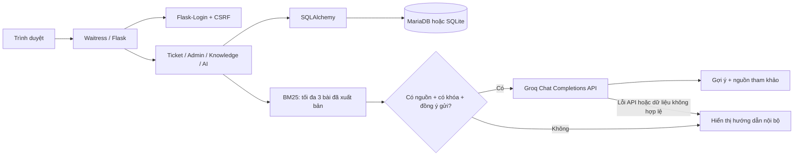
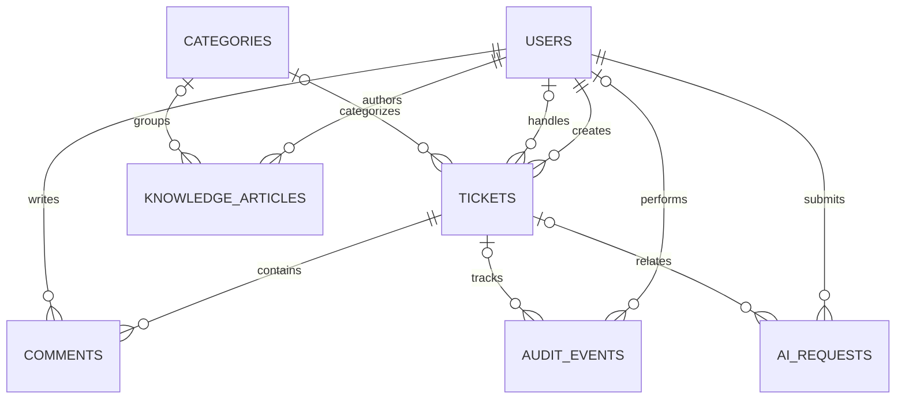
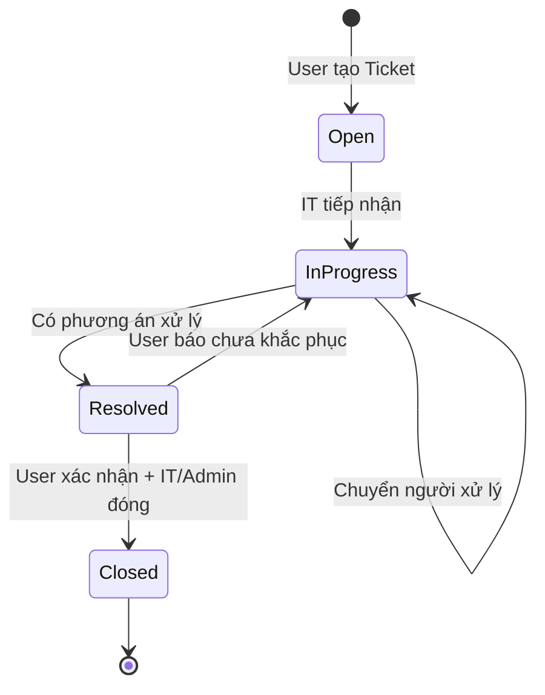

# Tài liệu nền cho báo cáo SmartTicket System

## 1. Bài toán và mục tiêu

Hệ thống quản lý yêu cầu hỗ trợ IT nhằm tập trung thông tin sự cố, phân công người xử lý, theo dõi tiến độ và nhận xác nhận từ người dùng. Kho kiến thức giúp tái sử dụng cách xử lý; trợ lý tìm bài liên quan bằng BM25 rồi gọi mô hình ngôn ngữ qua API Groq để tổng hợp gợi ý khi đủ điều kiện. Groq là nhà cung cấp API; mô hình được sử dụng qua dịch vụ, không phải mô hình do sinh viên tự huấn luyện.

Mục tiêu nghiệm thu là chạy được toàn bộ quy trình local với ba vai trò, kiểm soát truy cập, migration có thể tái tạo schema và có bằng chứng kiểm thử. Không tuyên bố hiệu quả kinh doanh hoặc độ chính xác AI khi chưa đo.

## 2. Tác nhân và use case

| Tác nhân | Chức năng |
|---|---|
| Khách | Đăng ký, đăng nhập |
| User | Tạo và xem Ticket của mình; bình luận; xác nhận kết quả; đọc bài đã xuất bản; hỏi trợ lý |
| IT Support | Xem Ticket; nhận/chuyển Ticket; nhập phương án; đóng khi được xác nhận; tạo bài nháp |
| Admin | Chức năng IT; dashboard, CSV, tài khoản/vai trò, danh mục, duyệt KB, nhật ký |

Quyền được kiểm tra tại server, không chỉ ẩn nút trong giao diện. User không được truy cập Ticket của người khác, kể cả qua liên kết trợ lý AI.

## 3. Kiến trúc

```mermaid
flowchart LR
    Browser[Trình duyệt] --> Server[Waitress / Flask]
    Server --> Auth[Flask-Login + CSRF]
    Server --> Routes[Ticket / Admin / Knowledge / AI]
    Routes --> ORM[SQLAlchemy]
    ORM --> DB[(MariaDB hoặc SQLite)]
    Routes --> Retrieval[BM25: tối đa 3 bài đã xuất bản]
    Retrieval --> Optional{Có nguồn + có khóa + đồng ý gửi?}
    Optional -->|Có| Groq[Groq Chat Completions API]
    Optional -->|Không| Local[Hiển thị hướng dẫn nội bộ]
    Groq --> Suggestion[Gợi ý + nguồn tham khảo]
    Groq -->|Lỗi API hoặc dữ liệu không hợp lệ| Local
```

Ứng dụng render HTML phía server bằng Jinja. CSS/JS Bootstrap được lưu local nên màn hình không phụ thuộc CDN. Database được quản lý bằng Flask-Migrate/Alembic; app khởi động không tự tạo bảng.

## 4. Mô hình dữ liệu

```mermaid
erDiagram
    USERS ||--o{ TICKETS : creates
    USERS o|--o{ TICKETS : handles
    CATEGORIES o|--o{ TICKETS : categorizes
    TICKETS ||--o{ COMMENTS : contains
    USERS ||--o{ COMMENTS : writes
    USERS ||--o{ KNOWLEDGE_ARTICLES : authors
    CATEGORIES o|--o{ KNOWLEDGE_ARTICLES : groups
    USERS o|--o{ AUDIT_EVENTS : performs
    TICKETS o|--o{ AUDIT_EVENTS : tracks
    USERS ||--o{ AI_REQUESTS : submits
    TICKETS o|--o{ AI_REQUESTS : relates
```

- `users`: tên đăng nhập duy nhất, mật khẩu băm, vai trò, trạng thái hoạt động.
- `tickets`: tiêu đề, mô tả, trạng thái, người tạo/người xử lý/danh mục, phương án, xác nhận và timestamp.
- `comments`: nội dung, tác giả, Ticket, thời điểm.
- `knowledge_articles`: nội dung văn bản, tác giả, danh mục, nháp/xuất bản, timestamp.
- `audit_events`: tác nhân, hành động, Ticket nếu có, tóm tắt và thời điểm.
- `ai_requests`: metadata phục vụ thống kê/giới hạn lượt, không lưu câu hỏi hoặc câu trả lời.

Các khóa ngoại duy trì liên kết. Tài khoản được khóa thay vì xóa để giữ lịch sử. Danh mục đang được dùng không được xóa.

## 5. Workflow Ticket

```mermaid
stateDiagram-v2
    [*] --> Open: User tạo Ticket
    Open --> InProgress: IT tiếp nhận
    InProgress --> InProgress: Chuyển người xử lý
    InProgress --> Resolved: Có phương án xử lý
    Resolved --> InProgress: User báo chưa khắc phục
    Resolved --> Closed: User xác nhận + IT/Admin đóng
    Closed --> [*]
```

Các tên thực trong database là `Open`, `In Progress`, `Resolved`, `Closed`. Việc User xác nhận không tự đóng Ticket. IT phải là người đang phụ trách để xử lý/chuyển/đóng; Admin có quyền điều phối. Ticket đã đóng không nhận bình luận mới. Các yêu cầu thay đổi trạng thái dùng khóa bản ghi trên MariaDB để hạn chế hai thao tác đồng thời.

## 6. Cơ chế AI và giới hạn

1. Chuẩn hóa câu hỏi và tài liệu: bỏ dấu tiếng Việt, tách token, loại một số từ phổ biến; đưa `Wi-Fi`, `wi fi` và `wifi` về cùng cách viết.
2. Lấy tối đa 500 bài đã xuất bản theo thời điểm cập nhật gần nhất. Mặc định xếp hạng bằng BM25 với `k1 = 1.5`, `b = 0.75`; lặp token tiêu đề 3 lần khi tạo văn bản dùng để tính điểm. Cách cũ (`baseline`) đếm từ trùng với trọng số tiêu đề 3 và nội dung 1 được giữ để so sánh, chọn qua `AI_RETRIEVAL_METHOD`.
3. Chọn tối đa 3 bài có điểm lớn hơn 0. Đây là **truy xuất từ khóa**, không dùng embedding hay tìm kiếm ngữ nghĩa/vector. Điểm dương chỉ cho biết có từ trùng, không bảo đảm tài liệu trả lời được câu hỏi.
4. Nếu không có khóa/không đồng ý gửi/không có nguồn thì không gọi Groq.
5. Khi đủ điều kiện, gửi câu hỏi và nguồn giới hạn độ dài đến Chat Completions, temperature 0.2, giới hạn đầu ra 900 token, timeout kết nối/đọc 5/25 giây. Model mặc định trong code là `openai/gpt-oss-20b`; giá trị `GROQ_MODEL` trong môi trường có thể ghi đè. Khi báo cáo một lần thử phải ghi model thực sự cấu hình cho lần đó.
6. Prompt yêu cầu bám nguồn, nói rõ khi thiếu thông tin, coi nội dung truy xuất là dữ liệu không tin cậy. Không có tool để thực thi hành động.
7. Lỗi chứng chỉ HTTPS, hết thời gian chờ, lỗi kết nối, lỗi khóa/quyền truy cập/model, giới hạn nhà cung cấp hoặc phản hồi sai định dạng chuyển về tra cứu nội bộ với thông báo tương ứng. Log chỉ ghi loại lỗi đã kiểm soát; không ghi API key hoặc nội dung phản hồi lỗi của nhà cung cấp. HTTPS vẫn xác minh chứng chỉ, dùng kho chứng chỉ hệ điều hành qua `truststore`.

Prompt giảm rủi ro nhưng không chứng minh loại bỏ hoàn toàn prompt injection/hallucination. Danh sách nguồn là tài liệu đã cung cấp cho mô hình, không phải xác minh tự động mọi câu trong phản hồi. Cần người xử lý kiểm tra trước khi áp dụng.

Phần tích hợp đã được sửa lỗi kết nối/cấu hình và người dùng xác nhận Groq hoạt động. Kiểm thử tự động dùng phản hồi giả lập để kiểm tra các nhánh thành công và lỗi; việc API trả nội dung thành công chưa chứng minh chất lượng câu trả lời. Chưa có bộ điểm do người chấm đánh giá câu trả lời Groq. Khi hoàn thiện báo cáo, lưu câu hỏi, nguồn, câu trả lời, chế độ, model và ngày thử; chấm riêng độ đúng, độ bám nguồn và khả năng thực hiện theo `evaluation/README.md`.

## 7. Bảo vệ dữ liệu

Mật khẩu băm bằng Werkzeug; Flask-Login quản lý phiên; tất cả POST có CSRF; logout dùng POST; Jinja escape nội dung; có kiểm tra độ dài/danh mục/vai trò; chặn xuất CSV thành công thức; giới hạn đăng nhập sai 10 lần/15 phút theo IP+tên đăng nhập trong một tiến trình. Metadata AI giới hạn 20 lượt/giờ/người dùng trong database. Không đưa API key vào template hoặc ghi nội dung phản hồi lỗi nhà cung cấp vào log.

Các biện pháp này phù hợp bản local và chưa thay thế một đợt kiểm thử bảo mật toàn diện. Khi triển khai Internet cần HTTPS, tài khoản database tối thiểu quyền, quản lý secrets, backup/restore vận hành, bộ đếm phân tán, giám sát và đánh giá tải.

## 8. Kết quả và trình bày trung thực

Xem `TEST_REPORT.md` để lấy kết quả kiểm thử theo từng đợt, gắn với phiên bản và thời điểm ghi nhận. Trong đợt nâng cấp database ngày 25/09/2026, dữ liệu gốc có 5 tài khoản, 3 danh mục, 6 Ticket và 3 bình luận được giữ nguyên; đã thêm riêng 1 Admin và 3 bài có nhãn `[Mẫu]`. Đây là số liệu lịch sử của lần nâng cấp, không phải tổng số bản ghi hiện tại. Bài mẫu phục vụ demo, không phải tri thức đã kiểm chứng bởi tổ chức.

Bộ đánh giá trong `evaluation/` gồm 20 bài mô phỏng và 48 câu hỏi tự biên soạn, chạy độc lập với database và không gọi Groq. Kết quả trên 20 câu diễn đạt lại:

| Chỉ số truy xuất | Baseline | BM25 |
|---|---:|---:|
| Hit@1: bài đúng đứng đầu | 8/20 (40%) | 11/20 (55%) |
| Hit@3: bài đúng trong 3 bài đầu | 12/20 (60%) | 16/20 (80%) |
| MRR@3 | 0.500 | 0.667 |

Hai phương pháp đều tìm đúng trên 20 câu trực tiếp. Với 8 câu ngoài phạm vi hoặc thiếu thông tin, cả hai vẫn trả nguồn ở cả 8 câu. Cần trình bày cả kết quả này: hệ thống còn hạn chế nhận biết thiếu nguồn. **80% là Hit@3 trên tập mô phỏng nhỏ, không phải độ chính xác câu trả lời AI.** Dữ liệu do nhóm phát triển biên soạn, chưa được đánh giá độc lập hoặc với người dùng thực; số liệu không thể khái quát cho mọi yêu cầu IT. Chi tiết từng câu, thời điểm và mã kiểm tra dữ liệu nằm trong `evaluation/results/results.json`.

Ảnh giao diện cần chụp từ ứng dụng thật sau khi đăng nhập, ghi rõ dữ liệu demo và che thông tin riêng. Chưa có biên bản kiểm tra thủ công toàn bộ giao diện kèm ảnh trong gói tài liệu này. Chạy tổng duyệt trên đúng máy trình bày theo `DEMO_SCRIPT.md`, ghi kết quả thực tế trước khi đánh dấu hoàn tất; không dùng ảnh minh họa dựng sẵn làm bằng chứng chạy thật.

## 9. Hướng phát triển

Email/thông báo, tệp đính kèm có kiểm tra, SLA/ưu tiên, SSO, phân quyền theo nhóm, tìm kiếm ngữ nghĩa/vector, nhận biết câu hỏi thiếu nguồn, đánh giá sinh câu trả lời với người phụ trách IT và người dùng độc lập, theo dõi chi phí và deployment có CI/CD. Đây là hạng mục tương lai, không liệt kê thành tính năng đã hoàn thành. AI hiện chưa tự động phân loại, đặt ưu tiên hoặc phân công Ticket.

## 10. Nguồn kỹ thuật

- Mã nguồn trong gói bàn giao là nguồn chính cho phân tích hiện trạng.
- Groq API: https://console.groq.com/docs/api-reference
- Groq models: https://console.groq.com/docs/models
- Chi tiết phiên bản dependencies: `requirements-lock.txt`.
